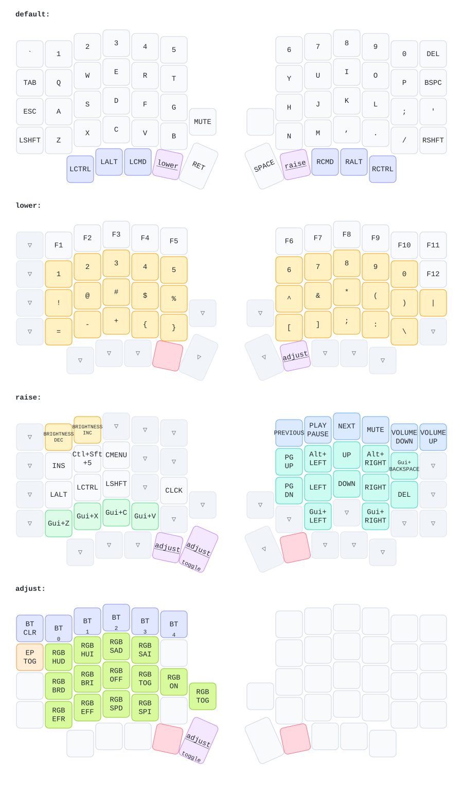

# PandaKB Sofle Choc Wireless

ZMK firmware config for a PandaKB-branded AliExpress Sofle Choc wireless RGB kit with SuperMini nRF52840 controllers. The board target is `nice_nano_v2`, and the working branch is intended to be the everyday firmware for this keyboard.

## ✅ Daily Status

- RGB works on both halves.
- OLED support is enabled in firmware, but the OLED modules should stay unplugged until their undersides are insulated.
- The current keymap is customized for macOS.
- A ZMK Studio left-half artifact builds. The normal left artifact is kept as the simpler daily-use fallback.
- This repo is pinned to ZMK `v0.2` because it is the current known-good build.

## ⌨️ Keymap



Daily layer notes:

- Base has Tab above Esc.
- Bottom-row Ctrl and Cmd/GUI are swapped for macOS.
- Lower has function keys, numbers, symbols, and brackets.
- Raise has brightness, media, navigation, delete, and clipboard shortcuts.
- Adjust has RGB, Bluetooth, and external power controls.

## 🧭 Layer Access

| Action | Result |
| --- | --- |
| Hold lower | Lower layer |
| Hold raise | Raise layer |
| Hold lower plus raise | Momentary adjust |
| Hold raise, then press left Enter thumb | Toggle adjust on |
| Press left Enter thumb on adjust | Toggle adjust off |

## 🌈 RGB Controls

RGB controls are on adjust.

| Key on Adjust | Binding |
| --- | --- |
| `1` | Hue down |
| `2` | Hue up |
| `3` | Saturation down |
| `4` | Saturation up |
| `Q` | Brightness down |
| `W` | Brightness up |
| `D` | RGB off |
| `F` | RGB toggle |
| `G` | RGB on |
| `Z` | Previous effect |
| `X` | Next effect |
| `C` | Animation speed down |
| `V` | Animation speed up |

## 📡 Bluetooth And Power

Bluetooth controls are on the adjust top row:

- `` ` `` position: clear Bluetooth bonds with `BT_CLR`.
- `1` through `5`: select Bluetooth profiles `0` through `4`.

External power toggle is on adjust at the `` ` `` key position on the second row. It is mainly a troubleshooting/control key for peripheral power. It does not need a daily spot on raise because RGB works through the normal RGB controls.

## ⚡ Flashing

The build creates these UF2 files:

- `sofle_left_pandakb_default.uf2`
- `sofle_left_pandakb_default_studio.uf2`
- `sofle_right_pandakb_default.uf2`

Use the normal left artifact when you want the simplest, lowest-moving-parts firmware. Use the Studio artifact when you specifically want ZMK Studio over USB.

The normal left artifact is probably worth keeping because it gives us a known-simple fallback if Studio RPC, USB UART, or a future ZMK Studio change ever causes weirdness. The downside is tiny: one extra UF2 in the artifact zip.

On macOS, copying a UF2 can show `Input/output error` if the bootloader reboots immediately after accepting the file. If the keyboard restarts and the new firmware works, the copy error can be ignored.

If Finder copy fails, this often still works:

```sh
cat firmware-pandakb-main-keymap/sofle_left_pandakb_default.uf2 > /Volumes/NICENANO/FLASH.UF2
sync
```

Replace `NICENANO` with the actual bootloader volume name.

## 🛠️ Creating New Builds

Most keymap edits can be made with Keymap Editor:

- https://nickcoutsos.github.io/keymap-editor/

After it commits a change to GitHub, the firmware workflow rebuilds automatically. Download the new `firmware` artifact from GitHub Actions and flash the relevant UF2.

Useful references while editing:

- ZMK keycode list: https://zmk.dev/docs/keymaps/list-of-keycodes
- Keymap Editor: https://nickcoutsos.github.io/keymap-editor/
- Keymap Drawer: https://github.com/caksoylar/keymap-drawer

ZMK naming reminders:

- ZMK uses `GUI` for Cmd on macOS.
- Consumer/media keys often use `C_` names, for example `C_VOLUME_UP`.
- Keyboard page keys often use plain names, for example `LEFT`, `RIGHT`, `PG_UP`, `DEL`.
- Keycodes are spelling-sensitive, and small shorthand mistakes can cause opaque build errors.

## 🖼️ Updating The Keymap Image

The README diagram is generated with `keymap-drawer`.

Generated files:

- `keymap-drawer/sofle.yaml`: parsed keymap data.
- `keymap-drawer/sofle.svg`: rendered diagram.
- `keymap-drawer/sofle-layout.dtsi`: local copy of the ZMK `v0.2` Sofle physical layout.
- `keymap_drawer.config.yaml`: color, styling, symbols, and friendly shortcut labels.

The drawer config uses `raw_binding_map` to rename exact bindings in the diagram. Examples:

- `&kp LG(Z)` is shown as `Undo`.
- `&kp LC(LS(NUMBER_5))` is shown as `Screenshot`.
- `&kp LG(BACKSPACE)` is shown as `Del Line`.
- Backspace, delete, enter, tab, escape, and arrow keys use symbols.

Regenerate locally:

```sh
keymap -c keymap_drawer.config.yaml parse -c 12 -z config/sofle.keymap -o keymap-drawer/sofle.yaml
keymap -c keymap_drawer.config.yaml draw -d keymap-drawer/sofle-layout.dtsi -l josefadamcik_sofle_layout keymap-drawer/sofle.yaml -o keymap-drawer/sofle.svg
```

The GitHub workflow `.github/workflows/draw-keymaps.yml` also regenerates the diagram after keymap changes.

## 📌 ZMK Version Pin

This repo is pinned to ZMK `v0.2` in two places:

- `config/west.yml`
- `.github/workflows/build.yml`

That pin keeps future ZMK changes from silently breaking a working keyboard. As of May 25, 2026, the latest ZMK release is `v0.3.0`. Upgrade deliberately: change both pin locations, build in GitHub Actions, flash only after the artifacts pass, and expect possible board/shield naming or Studio/display changes.

ZMK pinning reference:

- https://zmk.dev/blog/2025/06/20/pinned-zmk

## 🧩 Files That Matter

- `config/sofle.keymap`: layers, key behavior, RGB controls, encoder behavior, and the temporary RGB devicetree block.
- `config/sofle.conf`: ZMK feature flags for display, encoders, RGB, and Studio.
- `config/west.yml`: ZMK version pin.
- `build.yaml`: GitHub Actions build matrix.
- `.github/workflows/build.yml`: firmware build workflow.
- `.github/workflows/draw-keymaps.yml`: keymap diagram workflow.

## 🧯 Hardware Notes And Gotchas

- The PCB says PandaKB.
- The working RGB data pin is GPIO `P0.06`.
- The working LED chain length is `29` LEDs per half.
- The earlier db-ok Sofle Choc Wireless pin, GPIO `P0.08`, builds successfully but does not light LEDs on this PandaKB PCB.
- ZMK calls SK6812/WS2812-style addressable LEDs `RGB_UNDERGLOW`, even when the LEDs are per-key switch-socket LEDs.
- The LEDs are SK6812MINI-E.
- The OLED modules are SSD1306-style I2C displays.
- The OLED underside can contact controller pins. Add Kapton/polyimide insulation before installing a display.

## 🔗 Reference Repos

- PandaKB Sofle Choc firmware branch: `PandaKBLab/zmk-for-keyboards`, branch `zmk-for-sofle-choc`
- Reference Sofle layout image: https://github.com/josefadamcik/SofleKeyboard/blob/master/Images/soflekeyboard.png
- ZMK Sofle default keymap: `zmkfirmware/zmk`, tag `v0.2`
